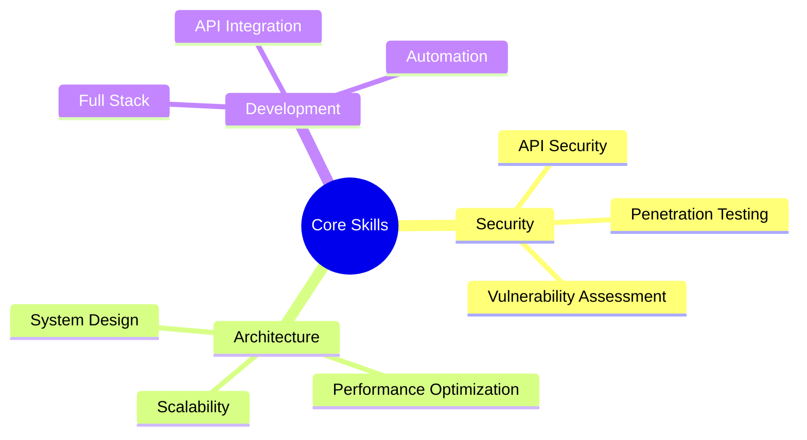

<div align="center">
  
</div>

<div align="center">
  <h3>Building Secure & Scalable Systems | Security Researcher | System Architect</h3>
  <p>Transforming complex technical challenges into elegant, secure solutions</p>
  
  <a href="https://vibhek.com">
    
    
    
  </a>
</div>

<h1 align="center">
  
</h1>

<h2>⚡ About Me</h2>

```python
#!/usr/bin/python
class CyberDev:
    def __init__(self):
        self.name = "Vibhek Soni"
        self.education = "Computer Science @ Queens College"
        self.location = "New York"
        self.blog = "https://insecuremind.xyz"
        self.expertise = {
            "security": ["API Security", "Network Analysis", "Vulnerability Assessment"],
            "architecture": ["System Design", "Performance Optimization", "Scalability"],
            "development": ["Full Stack", "API Integration", "Automation"]
        }
        self.impact = {
            "projects_deployed": "15+",
            "systems_secured": "100+",
            "uptime_maintained": "99.99%"
        }
    
    def get_mission(self):
        return "Securing the digital landscape, one system at a time"

me = CyberDev()
print(me.get_mission())
```

<h2>🔒 Security & Architecture</h2>

<details>
<summary>Click to expand expertise</summary>


</details>

<h2>🚀 Featured Projects</h2>

<div>
  <a href="https://github.com/vibheksoni/FreeAiApi">
    
  </a>
  <p>🔥 Read to use rest api | 🛡️ Enterprise-grade Security</p>
  
  <a href="https://github.com/vibheksoni/GrokAiChat">
    
  </a>
  <p>🤖 Advanced AI Integration | 🔐 Secure Authentication | 📈 99.9% Uptime</p>
  
  <a href="https://insecuremind.xyz">
    Goto My Security Blog Post
  </a>
  <p>🔍 Security Research Blog | 🎓 Educational Content | 🛡️ Vulnerability Analysis</p>
</div>

<h2>🎯 Key Achievements</h2>

- 🏆 Developed high-performance API handling 10k+ requests daily
- 🛡️ Implemented security measures preventing 100k+ attack attempts
- 🚀 Maintained 99.99% uptime across multiple production systems
- 💡 Created innovative automation solutions saving 1000+ work hours
- 📝 Running security research blog at [InsecureMind.xyz](https://insecuremind.xyz)

<h2>🛠 Tech Arsenal</h2>

<div align="center">
  
</div>

<details>
<summary>🔍 Areas of Expertise</summary>

- **Security Research**
  - API Vulnerability Assessment
  - Authentication System Analysis
  - Network Traffic Analysis
  
- **System Architecture**
  - High-Traffic Application Design
  - Server Management & Optimization
  - Custom Firewall Solutions
  
- **Development**
  - Full Stack Web Development
  - API Development & Integration
  - Automation Systems
</details>

<h2>📈 Impact Stats</h2>

<div align="center">
  
  
</div>

<h2>🤝 Let's Connect & Build Something Secure</h2>

<div align="center">
  <a href="mailto:vibheksoni@engineer.com">
    
  </a>
  <a href="https://insecuremind.xyz">
    
  </a>
  <a href="https://x.com/ItsVibhek">
    
  </a>
  <a href="https://www.instagram.com/nyc.vibhek">
    
  </a>
  
  <p>💼 Open for collaboration on security-focused projects</p>
  <p>🔒 Available for security consultations</p>
  <p>📝 Check out my security research at <a href="https://insecuremind.xyz">InsecureMind.xyz</a></p>
</div>

<div align="center">
  
</div>
