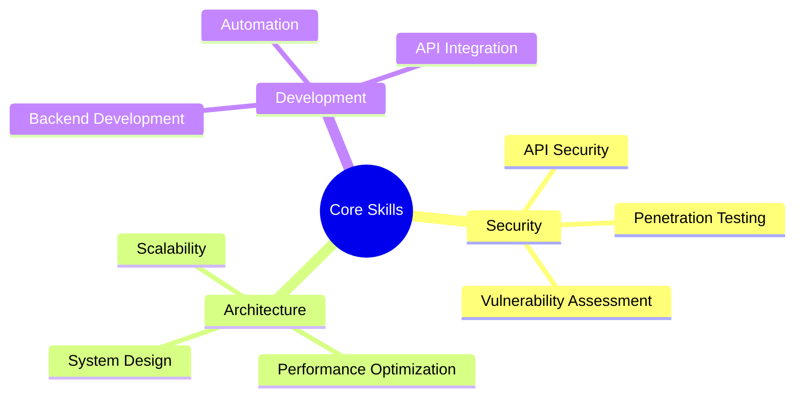

<div align="center">
  
</div>

<div align="center">
  <h3>Backend Developer | Security-Focused Engineer | System Architect</h3>
  <p>Crafting resilient, secure, and scalable systems with precision and passion</p>
  
  <a href="https://vibhek.com">
    
    
    
  </a>
</div>

<h1 align="center">
  
</h1>

<div align="center">
  <a href="https://app.daily.dev/vibheksoni">
    
  </a>
</div>

---

### ⚡ About Me

```python
#!/usr/bin/python
class CyberDev:
    def __init__(self):
        self.name = "Vibhek Soni"
        self.location = "New York, USA"
        self.website = "https://vibhek.com"
        self.blog = "https://insecuremind.xyz"
        self.expertise = {
            "security": ["API Security", "Network Analysis", "Vulnerability Assessment"],
            "architecture": ["System Design", "Performance Optimization", "Scalability"],
            "development": ["Backend Development", "API Integration", "Automation"]
        }
        self.impact = {
            "projects_deployed": "15+",
            "systems_secured": "100+",
            "uptime_maintained": "99.99%"
        }
    
    def get_mission(self):
        return "Securing and optimizing digital infrastructures for a safer web"

me = CyberDev()
print(me.get_mission())
```

---

### 🔒 Security & Architecture

<details>
<summary>Click to expand expertise</summary>


</details>

---

### 🚀 Featured Projects

- **CyberShield**: Developed a real-time firewall system in C, utilizing iptables for dynamic traffic filtering and DDoS mitigation.

- **LlmEndpoint**: Created a secure AI API platform with user authentication, token management, and usage analytics. Deployed using Docker, Flask, MySQL, Redis, and protected with Cloudflare.

- **Proxyit**: Engineered an IP cloaking web platform with robust authentication, Redis-backed session management, and Cloudflare integration for enhanced security.

- **StockAssist**: Built an AI-powered stock research assistant leveraging Google's AI models for real-time data analysis, charting, and sentiment evaluation. Features include 2FA, CAPTCHA, and session management.

- **HostQuick**: Developed a VPS automation tool for provisioning, securing, and deploying services with Docker and firewall configurations.

---

### 🎯 Key Achievements

- 🏆 Developed high-performance APIs handling 10k+ requests daily  
- 🛡️ Implemented security measures preventing 100k+ attack attempts  
- 🚀 Maintained 99.99% uptime across multiple production systems  
- 💡 Created innovative automation solutions saving 1000+ work hours  
- 📝 Running a security research blog at [InsecureMind.xyz](https://insecuremind.xyz)  

---

### 🛠 Tech Arsenal

<div align="center">
  
</div>

<details>
<summary>🔍 Areas of Expertise</summary>

- **Security Research**
  - API Vulnerability Assessment
  - Authentication System Analysis
  - Network Traffic Analysis
  
- **System Architecture**
  - High-Traffic Application Design
  - Server Management & Optimization
  - Custom Firewall Solutions
  
- **Development**
  - Backend Development
  - API Development & Integration
  - Automation Systems
</details>

---

### 📈 Impact Stats

<div align="center">
  
  
</div>

---

### 🤝 Let's Connect & Collaborate

<div align="center">
  <a href="mailto:vibheksoni@engineer.com">
    
  </a>
  <a href="https://insecuremind.xyz">
    
  </a>
  <a href="https://x.com/ImVibhek">
    
  </a>
  <a href="https://www.instagram.com/nyc.vibhek">
    
  </a>
  
  <p>💼 Open for collaboration on security-focused projects</p>
  <p>🔒 Available for security consultations</p>
  <p>📝 Explore my research at <a href="https://insecuremind.xyz">InsecureMind.xyz</a></p>
</div>

<div align="center">
  
</div>
