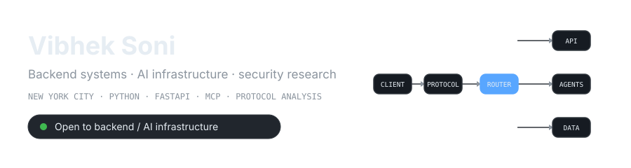
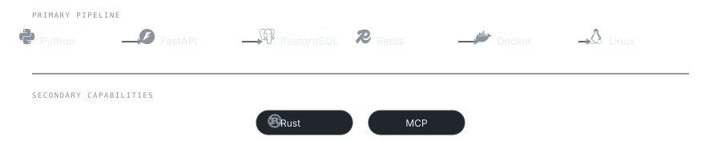
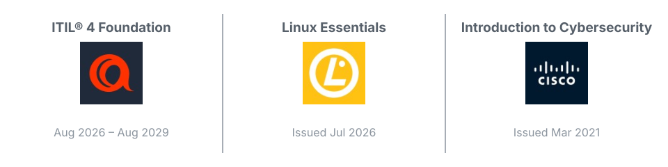

<picture>
  <source media="(prefers-color-scheme: dark)" srcset="assets/profile/hero-dark.svg">
  <source media="(prefers-color-scheme: light)" srcset="assets/profile/hero-light.svg">
  
</picture>

[Portfolio](https://vibheksoni.com) · [LinkedIn](https://www.linkedin.com/in/vibheksoni/) · [Email](mailto:vibheksoni@engineer.com) · [X](https://x.com/ImVibhek)

I build backend systems and research-driven developer tooling at the intersection of protocol analysis, automation, and security. Current work spans browser protocols, AI gateways, and local code intelligence.

> **Build loop:** observe real client behavior, reconstruct the protocol surface, then ship production-grade tools and SDKs.

---

## Proof

<picture>
  <source media="(prefers-color-scheme: dark)" srcset="assets/profile/proof-dark.svg">
  <source media="(prefers-color-scheme: light)" srcset="assets/profile/proof-light.svg">
  
</picture>

---

## Selected work

### stealth-browser-mcp

[GitHub repository](https://github.com/vibheksoni/stealth-browser-mcp) · `1.6k stars · 242 forks`

Browser automation and CDP tooling that gives AI agents control over navigation, network traffic, page state, and browser workflows.

`Python · MCP · CDP · browser automation`

### FreeTheAI

[Project site](https://freetheai.xyz/) · `60+ active models`

OpenAI-compatible AI infrastructure for model routing, streaming, tool calls, images, Messages, Responses, authentication, and usage tracking.

`API infrastructure · model routing · auth · streaming`

### More selected work

| Project | What I built | Stack and proof |
| --- | --- | --- |
| [Stock Assist](https://github.com/vibheksoni/stock-assist) | AI financial analysis platform with realtime market data, subscriptions, payments, caching, and WebSockets. | `Python · Flask · Redis · MySQL · WebSockets` · `46 active users` |
| [VerbalCodeAI](https://github.com/vibheksoni/VerbalCodeAi) | Local code intelligence for indexing repositories, search, retrieval, and terminal-first codebase navigation. | `Python · embeddings · retrieval · CLI` · `59 stars · 9 forks` |
| [unbuned](https://github.com/vibheksoni/unbuned) | Zero-dependency reverse engineering tool for recovering JavaScript from Bun-compiled executables. | `Python · binary analysis · reverse engineering` · `52 stars · 6 forks` |

<strong>More engineering and research</strong>

**Developer infrastructure**

- [UniClaudeProxy](https://github.com/vibheksoni/UniClaudeProxy): proxy for Claude Code across any LLM API.
- [pypi-query-mcp-server](https://github.com/vibheksoni/pypi-query-mcp-server): PyPI metadata and dependencies as MCP.
- [quickcontext](https://github.com/vibheksoni/quickcontext): local code context engine.
- [youtube-ai](https://github.com/vibheksoni/youtube-ai): YouTube SDK, CLI, API, and MCP without API keys.

**Protocol clients**

- [t3router](https://github.com/vibheksoni/t3router): Rust client for t3.chat multi-model access.
- [GrokAiChat](https://github.com/vibheksoni/GrokAiChat): Python client for Grok conversations.
- [axiomtrade-rs](https://github.com/vibheksoni/axiomtrade-rs): Rust SDK for Axiom Trade APIs.

**Security research**

- [ferrox](https://github.com/vibheksoni/ferrox): Rust research into infostealer behavior and defense.
- [dma-spoofer](https://github.com/vibheksoni/dma-spoofer): Windows hardware identifier research.
- [reversing-utils](https://github.com/vibheksoni/reversing-utils): open reverse engineering tooling.
- [secrets-wtf](https://github.com/vibheksoni/secrets-wtf): defensive AI infrastructure exposure index.

**Products and platforms**

- [crawl](https://github.com/vibheksoni/crawl): async web search and screenshot tooling with MCP.
- [cloneme](https://github.com/vibheksoni/cloneme): AI digital twin platform.
- [rust-serve](https://github.com/vibheksoni/rust-serve): multi-threaded Rust HTTP server.
- [DevHive Studios](https://devhivestudios.com): freelance development platform.

---

## Stack

<picture>
  <source media="(prefers-color-scheme: dark)" srcset="assets/profile/stack-dark.svg">
  <source media="(prefers-color-scheme: light)" srcset="assets/profile/stack-light.svg">
  
</picture>

---

## Credentials

**B.S. Computer Science** · Western Governors University · expected Dec 2026

---

Best contact: [vibheksoni@engineer.com](mailto:vibheksoni@engineer.com)

<strong>Other links</strong>

[YouTube](https://www.youtube.com/@vibheksoni) · [Instagram](https://www.instagram.com/nyc.vibhek/) · [OpenDoors](https://opendoors.wtf/) · [Buy Me a Coffee](https://buymeacoffee.com/vibheksoni)

