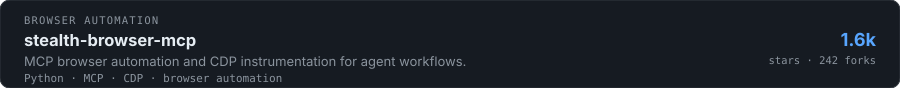
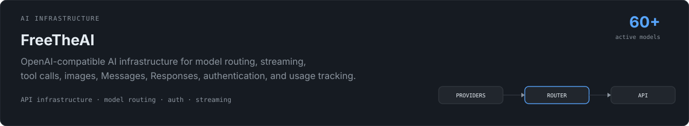
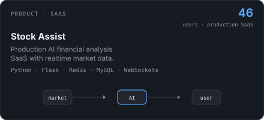
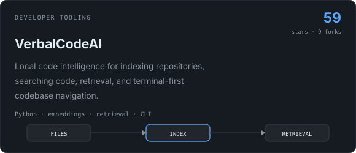
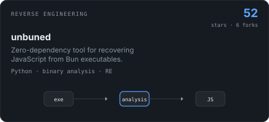

# Vibhek Soni

<picture>
  <source media="(prefers-color-scheme: dark)" srcset="assets/profile/hero-dark.svg">
  <source media="(prefers-color-scheme: light)" srcset="assets/profile/hero-light.svg">
  
</picture>

[Portfolio](https://vibheksoni.com) · [LinkedIn](https://www.linkedin.com/in/vibheksoni/) · [Email](mailto:vibheksoni@engineer.com) · [X](https://x.com/ImVibhek)

I build production APIs, AI infrastructure, retrieval systems, and research-driven developer tooling. The work sits at the intersection of protocol analysis, automation, and security.

> **Build loop:** observe real client behavior, reconstruct the protocol surface, ship production-grade tools and SDKs.

---

## Proof

<picture>
  <source media="(prefers-color-scheme: dark)" srcset="assets/profile/proof-dark.svg">
  <source media="(prefers-color-scheme: light)" srcset="assets/profile/proof-light.svg">
  
</picture>

---

## Flagship work

<a href="https://github.com/vibheksoni/stealth-browser-mcp">
<picture>
  <source media="(prefers-color-scheme: dark)" srcset="assets/profile/card-stealth-browser-mcp-dark.svg">
  <source media="(prefers-color-scheme: light)" srcset="assets/profile/card-stealth-browser-mcp-light.svg">
  
</picture>
</a>

<a href="https://freetheai.xyz/">
<picture>
  <source media="(prefers-color-scheme: dark)" srcset="assets/profile/card-freetheai-dark.svg">
  <source media="(prefers-color-scheme: light)" srcset="assets/profile/card-freetheai-light.svg">
  
</picture>
</a>

<a href="https://github.com/vibheksoni/stock-assist">
<picture>
  <source media="(prefers-color-scheme: dark)" srcset="assets/profile/card-stock-assist-dark.svg">
  <source media="(prefers-color-scheme: light)" srcset="assets/profile/card-stock-assist-light.svg">
  
</picture>
</a>

<a href="https://github.com/vibheksoni/VerbalCodeAi">
<picture>
  <source media="(prefers-color-scheme: dark)" srcset="assets/profile/card-verbalcodeai-dark.svg">
  <source media="(prefers-color-scheme: light)" srcset="assets/profile/card-verbalcodeai-light.svg">
  
</picture>
</a>

<a href="https://github.com/vibheksoni/unbuned">
<picture>
  <source media="(prefers-color-scheme: dark)" srcset="assets/profile/card-unbuned-dark.svg">
  <source media="(prefers-color-scheme: light)" srcset="assets/profile/card-unbuned-light.svg">
  
</picture>
</a>

<strong>More engineering and research</strong>

**Developer infrastructure**

- [UniClaudeProxy](https://github.com/vibheksoni/UniClaudeProxy): FastAPI proxy across Anthropic, OpenAI-compatible APIs, Gemini, and Ollama.
- [pypi-query-mcp-server](https://github.com/vibheksoni/pypi-query-mcp-server): MCP server for PyPI metadata, dependencies, and package intelligence.
- [quickcontext](https://github.com/vibheksoni/quickcontext): local code context engine with Rust parsing and Python retrieval.
- [youtube-ai](https://github.com/vibheksoni/youtube-ai): Python YouTube SDK, CLI, API, and MCP server without API keys.

**Protocol clients**

- [t3router](https://github.com/vibheksoni/t3router): Rust client for t3.chat conversations and multi-model access.
- [GrokAiChat](https://github.com/vibheksoni/GrokAiChat): Python client library for Grok conversations.
- [axiomtrade-rs](https://github.com/vibheksoni/axiomtrade-rs): Rust SDK for Axiom Trade APIs and WebSockets.

**Security research**

- [ferrox](https://github.com/vibheksoni/ferrox): Rust research into infostealer behavior and defensive detection.
- [dma-spoofer](https://github.com/vibheksoni/dma-spoofer): Windows hardware identifier and DMA behavior research.
- [reversing-utils](https://github.com/vibheksoni/reversing-utils): open tools for reverse engineering and binary analysis.
- [secrets-wtf](https://github.com/vibheksoni/secrets-wtf): defensive AI infrastructure exposure index for local LLM hosts.

**Products and platforms**

- [crawl](https://github.com/vibheksoni/crawl): async web search, fetch, and screenshot tooling with SDK, CLI, and MCP.
- [cloneme](https://github.com/vibheksoni/cloneme): AI digital twin platform with memory and multi-platform workflows.
- [rust-serve](https://github.com/vibheksoni/rust-serve): multi-threaded Rust HTTP server built from first principles.
- [DevHive Studios](https://devhivestudios.com): freelance development platform with realtime collaboration.

---

## Stack

<picture>
  <source media="(prefers-color-scheme: dark)" srcset="assets/profile/stack-dark.svg">
  <source media="(prefers-color-scheme: light)" srcset="assets/profile/stack-light.svg">
  
</picture>

---

## Education

**B.S. Computer Science** · Western Governors University · expected Dec 2026

## Certifications

---

## Contact

[Portfolio](https://vibheksoni.com) · [LinkedIn](https://www.linkedin.com/in/vibheksoni/) · [Email](mailto:vibheksoni@engineer.com) · [X](https://x.com/ImVibhek)

<strong>Other links</strong>

[YouTube](https://www.youtube.com/@vibheksoni) · [Instagram](https://www.instagram.com/nyc.vibhek/) · [OpenDoors](https://opendoors.wtf/) · [Buy Me a Coffee](https://buymeacoffee.com/vibheksoni)

Best contact: [vibheksoni@engineer.com](mailto:vibheksoni@engineer.com)
