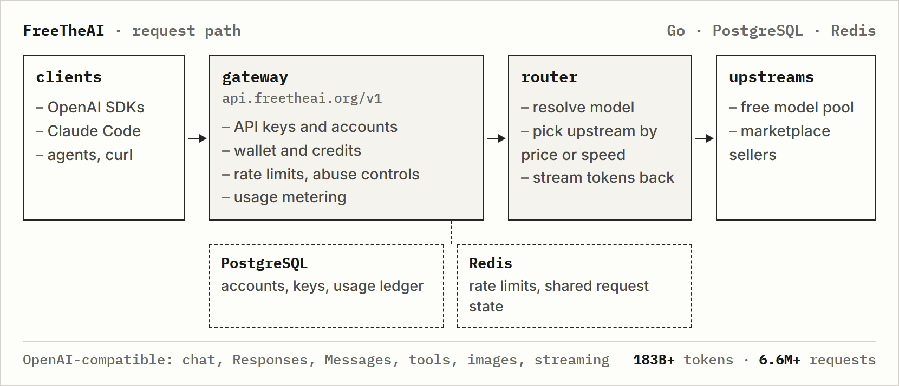

# Vibhek Soni

**Backend engineer in New York.** I build API infrastructure and security tools, usually by taking a protocol apart first and building on what I learn.

**Open to** backend, AI infrastructure, and security roles · [vibheksoni@engineer.com](mailto:vibheksoni@engineer.com) · [Portfolio](https://vibheksoni.com) · [LinkedIn](https://www.linkedin.com/in/vibheksoni/)

**Now:** building FreeTheAI's marketplace: one wallet, many model providers, routing by price or speed.

## Selected work

### FreeTheAI · free AI API and model marketplace, built in Go

**183B+ tokens and 6.6M+ requests served**, per the [public stats page](https://freetheai.org/stats). One OpenAI-compatible API with free models, paid plans for higher usage, and a marketplace where sellers list models at their own prices. I built and run the gateway: API keys and accounts, wallet and credits, rate limits, abuse controls, usage metering, and model routing. [freetheai.org](https://freetheai.org/) · [Docs](https://freetheai.org/docs) · [Status](https://freetheai.org/status)

<picture>
  <source media="(prefers-color-scheme: dark)" srcset="assets/freetheai-dark.png">
  
</picture>

### stealth-browser-mcp · browser automation for AI agents

**2.1k+ stars, 296 forks.** An MCP server that lets agents drive a real Chrome browser over the DevTools Protocol: navigation, network hooks, DOM extraction, and UI cloning. Python, FastMCP. [Repo](https://github.com/vibheksoni/stealth-browser-mcp)

### UniClaudeProxy · one Claude Code client, any model backend

FastAPI proxy that translates the Anthropic API to OpenAI, Gemini, DeepSeek, and Ollama, with streaming and tool calling. [Repo](https://github.com/vibheksoni/UniClaudeProxy)

### unbuned · JavaScript recovery from Bun executables

Reverse engineering tool that extracts the JavaScript bundled into Bun-compiled binaries, for malware analysis and code recovery. Zero dependencies. [Repo](https://github.com/vibheksoni/unbuned)

### secrets.wtf · exposed AI infrastructure index

**181 exposed Ollama and LM Studio hosts** found through internet-wide scanning, listed with remediation steps. Research write-ups on [OpenDoors](https://opendoors.wtf/). [Site](https://secrets.wtf/)

<strong>More projects</strong>

**Developer tools**

- **t3router:** Rust terminal client for multi-model chat with usage tracking. [Repo](https://github.com/vibheksoni/t3router)
- **axiomtrade-rs:** async Rust trading API SDK with WebSocket streaming. [Repo](https://github.com/vibheksoni/axiomtrade-rs)
- **VerbalCodeAI:** local code indexing and search from the terminal. [Repo](https://github.com/vibheksoni/VerbalCodeAi)
- **quickcontext:** local code context engine (Rust parsing, Python indexing). [Repo](https://github.com/vibheksoni/quickcontext)
- **pypi-query-mcp-server:** PyPI metadata and dependency lookups over MCP. [Repo](https://github.com/vibheksoni/pypi-query-mcp-server)
- **crawl:** async web search, fetch, and screenshot toolkit with MCP. [Repo](https://github.com/vibheksoni/crawl)
- **Stock Assist:** AI stock research SaaS (Flask, Redis, MySQL, WebSockets) that served 46 users. [Repo](https://github.com/vibheksoni/stock-assist)

**Security research**

- **reversing-utils:** reverse engineering helpers. [Repo](https://github.com/vibheksoni/reversing-utils)
- **dma-spoofer:** Rust research into Windows hardware identifier spoofing over DMA. [Repo](https://github.com/vibheksoni/dma-spoofer)
- **ferrox:** Rust infostealer proof of concept. [Repo](https://github.com/vibheksoni/ferrox)

## Stack

**Languages:** Python, Go, Rust, C, SQL 
**Backend:** FastAPI, Flask, Gin, PostgreSQL, Redis, WebSockets, Docker, Linux 
**Security:** reverse engineering, protocol analysis, network scanning, iptables

## Education and certifications

**B.S. Computer Science**, Western Governors University, Sep 2026 
**ITIL 4 Foundation**, PeopleCert, Aug 2026 · [verify](https://badges.peoplecert.org/Badge/en/2/3CCF0E54-7F7F-40A5-A9AC-BF1FB204B1AA) 
**Linux Essentials**, Linux Professional Institute, Jul 2026 · [verify](https://www.credly.com/badges/60d6cd3d-fbda-4552-8f37-b6ea79a85471) 
**Introduction to Cybersecurity**, Cisco, Mar 2021 · [verify](https://www.credly.com/badges/6b8b3185-bd04-405e-92ca-134c70312e95)

## Elsewhere

[vibheksoni.com](https://vibheksoni.com/) · [FreeTheAI](https://freetheai.org/) · [secrets.wtf](https://secrets.wtf/) · [OpenDoors](https://opendoors.wtf/) (blog) · [LinkedIn](https://www.linkedin.com/in/vibheksoni/) · [X](https://x.com/ImVibhek) · [YouTube](https://www.youtube.com/@vibheksoni) · [Instagram](https://www.instagram.com/nyc.vibhek/) · [Buy Me a Coffee](https://buymeacoffee.com/vibheksoni)
